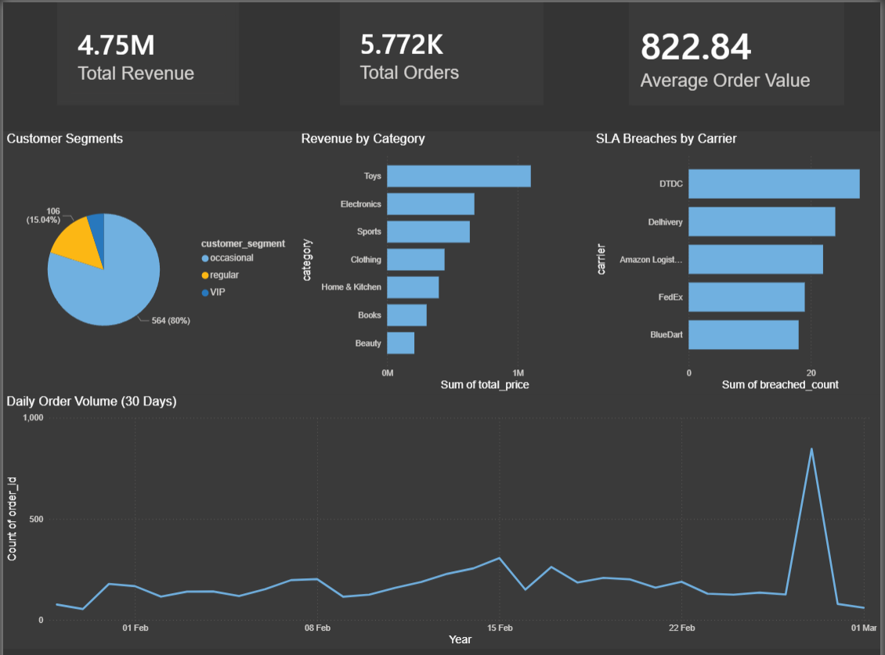
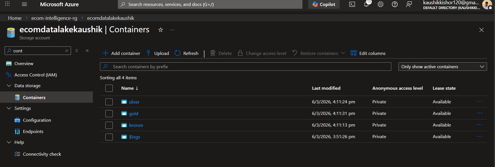
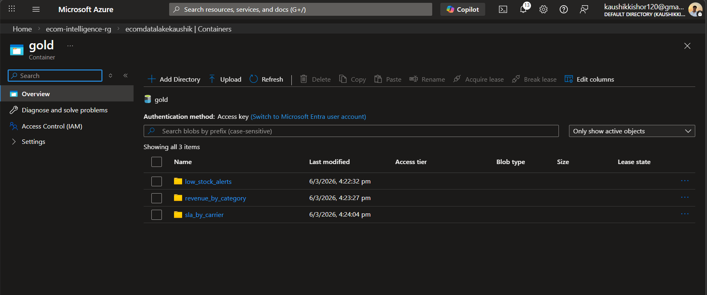
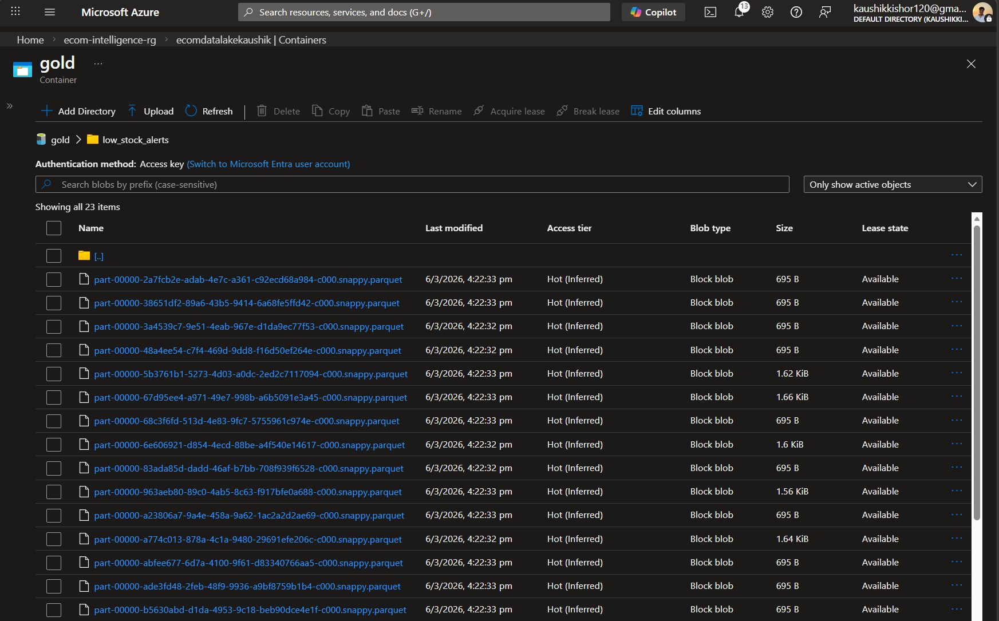
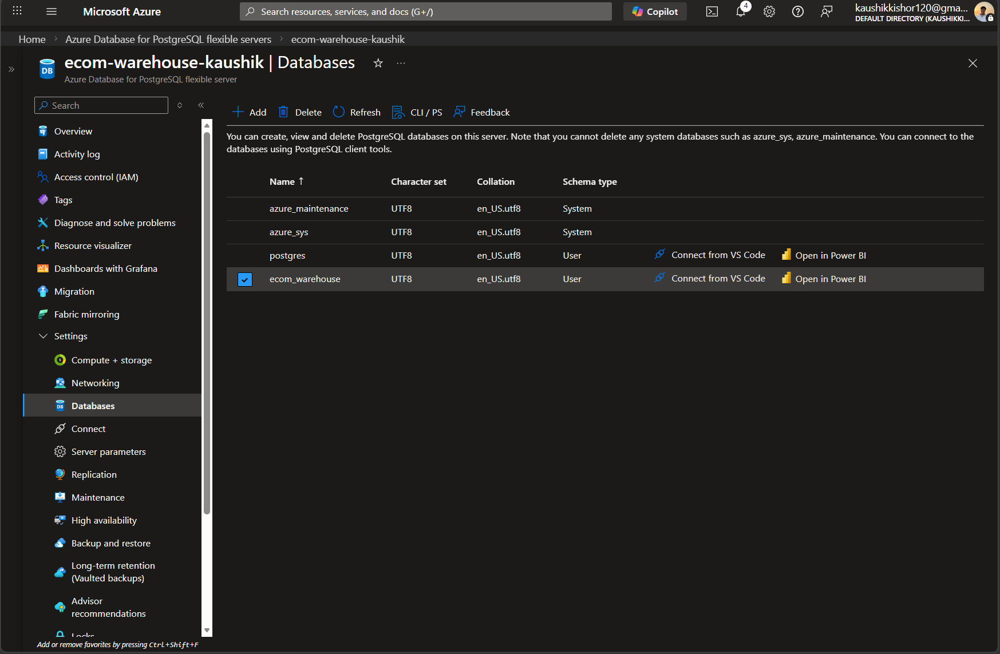
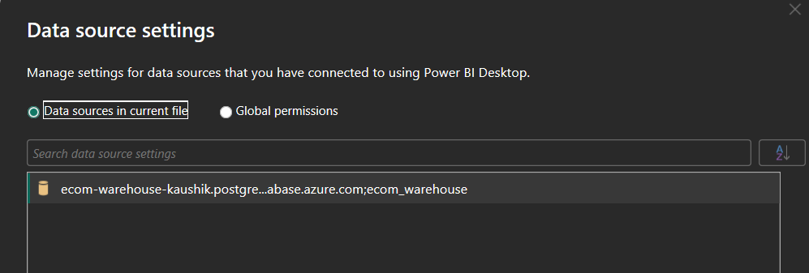

# Real-Time E-Commerce Intelligence Platform

A production-grade data engineering project simulating an Amazon/Flipkart-style 
e-commerce backend with real-time streaming, medallion architecture, dimensional 
modeling, and ML-based anomaly detection.

## Dashboard


## Architecture
```
Python Producers (Faker)
        ↓
Apache Kafka (3 topics: orders, inventory, shipments)
        ↓
Apache Spark Structured Streaming
        ↓
Medallion Architecture (Bronze → Silver → Gold)
        ↓
PostgreSQL + dbt (Dimensional Warehouse)
        ↓
Power BI Dashboard + Anomaly Detection
```

## Tech Stack

| Layer | Technology |
|-------|-----------|
| Data Generation | Python, Faker |
| Message Broker | Apache Kafka |
| Stream Processing | Apache Spark Structured Streaming |
| Storage | Apache Parquet (Medallion Architecture) |
| Warehouse | PostgreSQL |
| Transformations | dbt (data build tool) |
| Orchestration | Docker |
| BI Dashboard | Power BI |
| Anomaly Detection | Scikit-learn (Isolation Forest, Z-score) |
| Cloud | Azure Data Lake Gen2, Azure Database for PostgreSQL |

## Cloud Infrastructure (Azure)

### Azure Data Lake Gen2 — Medallion Architecture



Azure Data Lake Gen2 storage account configured using the **Medallion architecture**.  
Data is organized into separate layers to support scalable and reliable analytics pipelines:

- **Bronze** – Raw ingested data from source systems  
- **Silver** – Cleaned and transformed datasets  
- **Gold** – Aggregated, analytics-ready datasets used for reporting  
- **Logs** – Pipeline execution logs and monitoring data

This layered approach improves **data quality, governance, and performance for downstream analytics**.

---



Inside the **Gold layer**, curated analytics datasets are stored as independent directories such as:

- `revenue_by_category`
- `sla_by_carrier`
- `low_stock_alerts`

These datasets represent **business-level metrics and aggregates** that power dashboards and reporting tools.

---



Each dataset is stored as **partitioned Parquet files** inside Azure Data Lake Gen2.

Parquet provides:
- **Columnar storage for efficient analytics**
- **Reduced storage footprint**
- **Faster query performance for downstream processing and BI tools**

These files are later consumed by the **data warehouse and Power BI dashboards**.

### Azure Database for PostgreSQL


Dimensional warehouse (fact_orders, dim_product, dim_user, dim_date) migrated to Azure Database for PostgreSQL flexible server.

### Power BI Connected to Azure


Power BI dashboard connected directly to Azure PostgreSQL — data source visible in connection settings.

## Project Structure
```
ecom-intelligence/
├── producers/
│   ├── order_producer.py        # Simulates order events ~1/sec
│   ├── inventory_producer.py    # Simulates inventory updates
│   ├── shipment_producer.py     # Simulates shipment events
│   └── historical_generator.py # Generates 30 days of backfill data
├── consumers/
│   ├── spark_streaming.py       # Spark Structured Streaming job
│   └── anomaly_detector.py      # ML anomaly detection
├── storage/
│   ├── bronze/                  # Raw parquet (partitioned by date/hour)
│   ├── silver/                  # Cleaned and filtered data
│   └── gold/                    # Business aggregations
├── warehouse/
│   └── load_to_postgres.py      # Loads gold layer into PostgreSQL
├── ecom_dbt/
│   └── models/
│       ├── staging/             # stg_orders, stg_revenue, stg_sla
│       └── marts/               # fact_orders, dim_product, dim_user, dim_date
├── docker-compose.yml
└── requirements.txt
```

## Data Pipeline

### Phase 1 — Data Generation
Simulates realistic e-commerce events using Python and Faker:
- 10,000+ unique users across IN, US, UK, SG
- 500 products across 7 categories with realistic price ranges
- Weighted random order frequency with occasional demand spikes
- Shipment SLA breaches and inventory reorder triggers built into simulation

### Phase 2 — Streaming Layer
Apache Kafka receives events across 3 topics. Apache Spark Structured 
Streaming processes them in micro-batches with:
- Rolling 1-minute revenue aggregations by category
- Real-time low stock alerts (reorder threshold detection)
- SLA breach tracking by carrier with delay metrics

### Phase 3 — Medallion Architecture
Three-layer storage deployed to Azure Data Lake Gen2:
- **Bronze** — raw events partitioned by year/month/day/hour
- **Silver** — cleaned data (nulls removed, schema enforced, anomalous quantities filtered)
- **Gold** — business aggregations (revenue by category, SLA by carrier, low stock alerts)

### Phase 4 — Dimensional Warehouse
Gold layer loaded into PostgreSQL, transformed with dbt:
- `fact_orders` — 5,000+ order transactions
- `dim_product` — 500 products with revenue stats
- `dim_user` — customer segmentation (VIP/regular/occasional)
- `dim_date` — calendar dimension with weekend flags
- 11 dbt data quality tests (uniqueness, not-null, referential integrity)

### Phase 5 — BI Dashboard
Power BI connected to Azure PostgreSQL warehouse:
- $4.75M simulated revenue tracked across 30 days
- Demand spike detection visible in daily order volume chart
- SLA breach rates by carrier
- Customer segment distribution

### Phase 6 — Anomaly Detection
Three detectors running every 60 seconds:
- **Payment Fraud** — Isolation Forest on user order frequency/spend patterns
- **Demand Spikes** — Z-score analysis flagging categories > 2.5σ above baseline
- **Revenue Anomalies** — Isolation Forest on gold layer revenue windows
- Alerts persisted to `anomaly_alerts` PostgreSQL table with severity levels

## Key Metrics
- Generated **~50,000 synthetic events** over **30 simulated days**
- Processed **15,000+** streaming events across 3 Kafka topics
- Achieved **~3 second** micro-batch latency in local Spark cluster
- Built medallion architecture with **automated checkpointing** for fault tolerance
- **11/11** dbt data quality tests passing
- Detected **6.6-7.3σ** demand spikes during simulated promotional period
- Anomaly detection running on **3 detection algorithms** simultaneously

## Setup & Running

### Prerequisites
- Python 3.10
- Docker Desktop
- Java 11 (Temurin)
- Power BI Desktop

### Local Setup
```bash
# Clone repo
git clone https://github.com/Kaushik-Kishor/ecom-intelligence-platform.git
cd ecom-intelligence-platform

# Create virtual environment
python -m venv venv
venv\Scripts\activate  # Windows

# Install dependencies
pip install -r requirements.txt

# Start Kafka + PostgreSQL
docker-compose up -d

# Run producers (3 separate terminals)
python producers/order_producer.py
python producers/inventory_producer.py
python producers/shipment_producer.py

# Run Spark streaming (4th terminal)
python consumers/spark_streaming.py

# Load to warehouse (after data accumulates)
python warehouse/load_to_postgres.py

# Run dbt transformations
cd ecom_dbt
dbt run
dbt test

# Run anomaly detection
python consumers/anomaly_detector.py
```

## What I Learned
- Designing fault-tolerant streaming pipelines with checkpointing
- Medallion architecture tradeoffs (latency vs storage cost vs query performance)
- Why dbt exists — separating business logic from infrastructure
- Isolation Forest vs Z-score — when to use unsupervised ML vs statistical methods
- Windows-specific Spark configuration (HADOOP_HOME, winutils, native libraries)